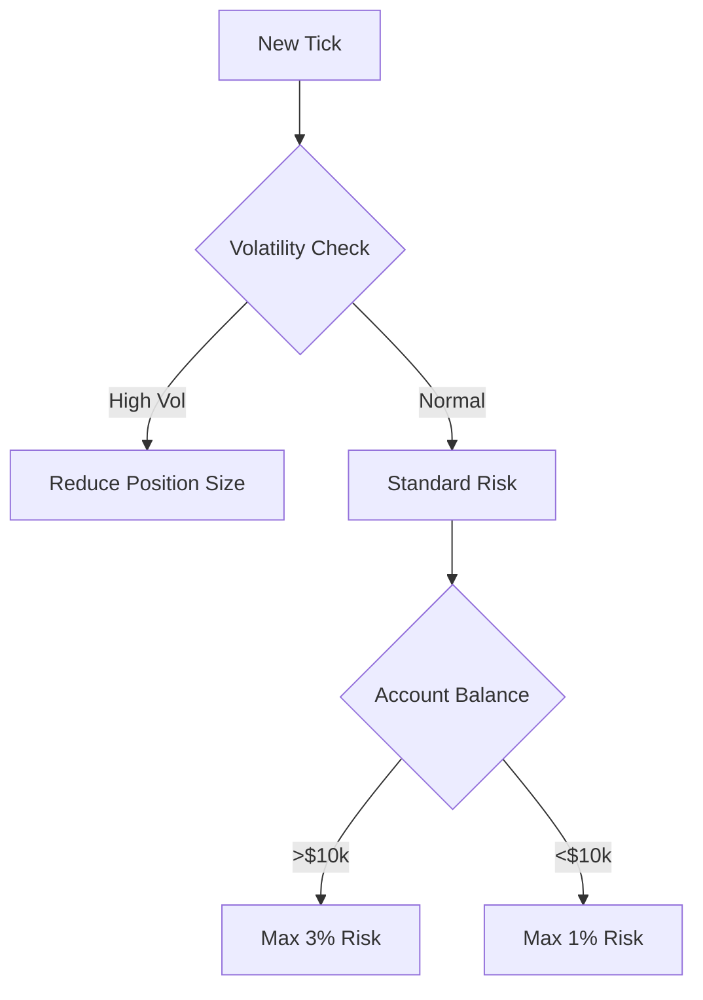

# 🏆 AlaaGold EA - Advanced Algorithmic Trading System for XAUUSD


**Advanced multi-strategy Expert Advisor for XAUUSD on MetaTrader 5**
*Combining 14+ institutional-grade strategies with smart risk management*

---

## 🌟 Key Features

### 📊 Multi-Strategy Fusion Engine
| Strategy | Weight | Description |
|---|---|---|
| Candle Patterns | 1 | Japanese candlestick reversal patterns |
| Chart Patterns | 2 | Classic technical patterns (H&S, Triangles) |
| Price Action | 2 | Raw price movement analysis |
| Elliott Waves | 3 | Wave principle analysis |
| Indicators | 1 | RSI, MACD, Stochastic, ADX signals |
| Divergence | 3 | Price/indicator divergence detection |
| Harmonic Patterns | 3 | Advanced geometric patterns (Gartley, Butterfly, Bat) |
| Volume Analysis | 2 | Tick volume confirmation |
| Wolfe Waves | 3 | Momentum-based wave patterns |
| Multi-Timeframe | 2 | Higher timeframe confirmation |
| Time Analysis | 1 | Session/time-based filters |
| Pivot Points | 2 | Institutional pivot levels |
| Support/Resistance | 3 | Dynamic SR levels |
| MA Crossovers | 2 | Moving average systems |
| Trend Patterns | 2 | Trend breakout patterns |

### ⚙️ Core System Features
- Dynamic ATR-based position sizing (1-3% risk)
- Multi-layer confirmation system (4+ weighted strategies required)
- Adaptive stop-loss (fixed or volatility-based)
- Trading session filters (London/NY/Tokyo/Sydney)
- Bad day detection (NFP, holidays, volatility)
- Anti-Martingale money management
- Tick-level execution monitoring
- Fast Strategy Tester mode
- Strategy tagging in trade comments

---

## 🛠 Installation Guide

### Requirements
- MetaTrader 5
- Minimum 100 bars of historical data
- Recommended VPS for 24/7 operation

### Steps
1. Clone repository:
   ```bash
   git clone https://github.com/Alaashoky/alaagold.git
   ```
2. Copy files to MT5 terminal:
   - `AlaaGoldEA.mq5` → `MQL5/Experts`
   - `*.mqh` files → `MQL5/Experts` (same directory)
3. Compile EA in MetaEditor
4. Attach to XAUUSD H1 chart

---

## 📊 Strategy Configuration Example

```mql5
// Risk Parameters
input double Risk_Percent = 1.0;    // Risk per trade (%)
input int StopLoss_Pips = 100;      // Fixed SL (pips)
input bool Use_Dynamic_StopLoss = true; // ATR-based SL

// Strategy Activation
input bool Use_CandlePatterns = true;
input bool Use_ChartPatterns = true;
input bool Use_Divergence = true;

// Weight Adjustments
input int CandlePatterns_Weight = 1;
input int Divergence_Weight = 3;
```

---

## 🛡 Risk Management



---

**Disclaimer**: Trading forex/CFDs carries high risk. This EA is for educational purposes only. Past performance doesn't guarantee future results. Test thoroughly before live trading.